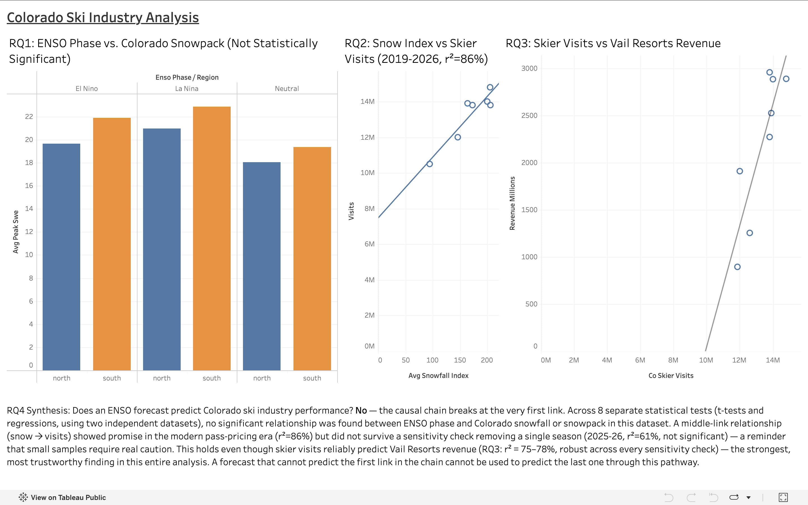

# Colorado Rockies Snowfall → Ski Industry Business Impact

**Status:** ✅ Complete — all research questions answered, dashboard published
**Stack:** PostgreSQL · SQL · Python (acquisition/cleaning) · Tableau Public
**Live dashboard:** [Colorado Ski Industry Analysis on Tableau Public](https://public.tableau.com/app/profile/trent.tadewald/viz/ColoradoSkiIndustryAnalysis/Dashboard1)

**TL;DR:** Tested whether El Niño (ENSO) forecasts can predict Colorado ski
industry revenue, by chaining four sub-questions: ENSO → snowfall → skier
visits → revenue. Answer: no — the chain breaks at the very first link
(ENSO does not predict snowfall at these 7 Colorado stations, across 8
separate tests), even though the back half of the chain (visits → revenue)
is genuinely robust (r²=75-78%, survives every sensitivity check). Full
pipeline: Python data acquisition from 4 public sources → PostgreSQL schema
with confounders as real constraints, not query logic → SQL analysis →
Python significance testing (scipy) → Tableau dashboard.



## Motivating question

Does the El Niño–Southern Oscillation (ENSO) climate pattern predict Colorado
snowfall, and if so, does that translate into measurable changes in
ski-industry participation (skier visits) and business performance
(revenue)? Where does that causal chain hold up, and where does it break
down?

This is framed as a **chain of four sub-questions**, each answered on its own
evidence before being combined — not a single end-to-end correlation. See
[`docs/scoping.md`](docs/scoping.md) for the full research questions,
hypotheses, and known confounders.

## Project structure

```
├── README.md              # you are here
├── docs/
│   ├── scoping.md          # research questions, hypotheses, confounders, non-goals
│   ├── data_dictionary.md  # every data source, station ID, coverage, date range
│   └── progress.md         # running log of what's been done, phase by phase
├── data/
│   ├── raw/                # (gitignored) untouched downloads — see data_dictionary.md to regenerate
│   └── processed/          # cleaned CSVs ready to load into Postgres
├── sql/
│   ├── schema.sql          # CREATE TABLE statements
│   └── analysis/           # RQ1, RQ2, RQ3 query sets
├── scripts/                # Python fetch/clean scripts
└── dashboard/              # Tableau workbook + link to published version
```

## Findings

This project tested a causal chain: **ENSO climate phase → Colorado
snowfall → skier visits → resort revenue.** Each link was tested
independently, with a stated hypothesis, before moving to the next.

**RQ1 — Does ENSO predict Colorado snowfall?** No. Across 8 separate
statistical tests (t-tests and regressions, two independent datasets,
station data extended back to 1950), no statistically significant
relationship was found between ENSO phase and snowfall or snowpack, in
either northern or southern Colorado. An early borderline result
(p=0.047) correctly did not survive extension to the full dataset
(p=0.083). See [`docs/findings/rq1_findings.md`](docs/findings/rq1_findings.md).

**RQ2 — Does snowfall predict skier visits?** Suggestive, but not
confirmed. A strong relationship in the modern pass-pricing era
(2019-2026, r²=86%) did not survive a sensitivity check removing the
historic 2025-26 drought season (r²=61%, no longer significant). See
[`docs/findings/rq2_findings.md`](docs/findings/rq2_findings.md).

**RQ3 — Do skier visits predict Vail Resorts revenue?** Yes — the most
robust finding in the project. A significant relationship (r²=75-78%)
survived every sensitivity check applied (excluding the one acquisition
year, restricting to the most recent 5-season cluster), despite having
the smallest sample size of any test in this analysis. See
[`docs/findings/rq3_findings.md`](docs/findings/rq3_findings.md).

**RQ4 — Does an ENSO forecast predict Colorado ski industry
performance?** No, based on this project's data. The causal chain
breaks at the very first link. Even though the visits → revenue link is
genuinely robust, a forecast that cannot reliably predict Colorado
snowfall cannot be used to predict Colorado ski industry performance
through this pathway. See
[`docs/findings/rq4_synthesis.md`](docs/findings/rq4_synthesis.md).

**Interactive dashboard:** all three quantitative findings are
visualized, with their actual statistical results and honest caveats,
in the Tableau Public dashboard linked above.

## How to reproduce this

1. Install PostgreSQL locally and create a database (e.g. `colorado_ski`).
2. Clone this repo, then install Python dependencies:
   ```
   pip install -r requirements.txt
   ```
3. Copy `.env.example` to `.env` (not committed — see `.gitignore`) and add
   a free NOAA CDO API token (required to re-pull GHCND station data — see
   `docs/data_dictionary.md` for how to get one). Postgres connection
   details are read from the standard `psycopg2`/`libpq` environment
   variables (e.g. `PGHOST`, `PGUSER`) if your local setup needs them;
   scripts connect to a local `colorado_ski` database by default.
4. Run `sql/schema.sql` against your database to create the 7 tables.
5. Regenerate the raw data downloads per the sourcing notes in
   [`docs/data_dictionary.md`](docs/data_dictionary.md) (raw files are
   gitignored, not committed), then run the `scripts/load_*.py` scripts to
   load them into Postgres.
6. Run the analysis: the `sql/analysis/*.sql` query sets, and the
   `scripts/rq*_significance_test.py` scripts for the statistical tests.
7. Run `scripts/export_dashboard_data.py` to regenerate the CSVs under
   `dashboard/data/`, which feed the Tableau workbook.

## License

MIT — see [`LICENSE`](LICENSE).